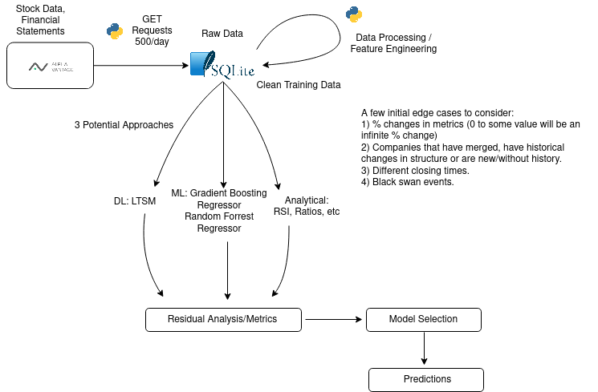

<!--
*** Thanks for checking out the Best-README-Template. If you have a suggestion
*** that would make this better, please fork the repo and create a pull request
*** or simply open an issue with the tag "enhancement".
*** Thanks again! Now go create something AMAZING! :D
-->

<!-- PROJECT SHIELDS -->
<!--
*** I'm using markdown "reference style" links for readability.
*** Reference links are enclosed in brackets [ ] instead of parentheses ( ).
*** See the bottom of this document for the declaration of the reference variables
*** for contributors-url, forks-url, etc. This is an optional, concise syntax you may use.
*** https://www.markdownguide.org/basic-syntax/#reference-style-links
-->
<!--[![Contributors][contributors-shield]][contributors-url]
[![Forks][forks-shield]][forks-url]
[![Stargazers][stars-shield]][stars-url]
[![Issues][issues-shield]][issues-url]
[![MIT License][license-shield]][license-url]-->
[![LinkedIn][linkedin-shield]](https://www.linkedin.com/in/james-mullinix-281787161/)

<!-- PROJECT LOGO -->
 

  

  <h3 align="center">Rensselaer AI Systems</h3>

  

    A repository for the work in ENGR 6222
     
    <a href="https://github.com/jmullini/rensselaer_ai_systems"><strong>Explore the docs »</strong></a>
     
     
    <!--<a href="https://github.com/jmullini/rensselaer_ml_data_architecture">View Demo</a>
    ·
    <a href="https://github.com/jmullini/rensselaer_ml_data_architecture">Report Bug</a>
    ·
    <a href="https://github.com/jmullini/rensselaer_ml_data_architecture">Request Feature</a>
  -->
  

<!-- ABOUT THE PROJECT -->
## Modeling the S&P 100

### Overview

In this project we will attempt to model the price movement of equities in the S&P 100 over certain time windows (monthly, quarterly, yearly). The data driving the modeling process will be sourced from the API provided by <a href="https://www.alphavantage.co/">Alpha Vantage</a>. Alpha Vantage provides several years of pricing information as well as a suite of financial statements available through the API. The service is rate limited at 500 requests per day so we will have to build out the ETL scripts and generate the base data over the course of a few days. From there we will process data into a SQLite database for persistence. We will be trying a few techniques including regression and LTSM.  

#### Potential Features

These are features that I would expect to have an impact on the price of S&P 100 equities:

  * Changes in financial statement line items month over month, quarter over quarter, and year over year.
  * Certain ratios used in financial analysis like the quick ratio, current ratio, debt to equity ratio and others.
  * RSI and changes in RSI.
  * Macro indicators like the effective federal funds rate, the unemployment rate, and other macro economic metrics.

#### Project Architecture

An initial idea of how the project will work:

<!-- MARKDOWN LINKS & IMAGES -->
<!-- https://www.markdownguide.org/basic-syntax/#reference-style-links -->
[contributors-shield]: https://img.shields.io/github/contributors/othneildrew/Best-README-Template.svg?style=for-the-badge
[contributors-url]: https://github.com/othneildrew/Best-README-Template/graphs/contributors
[forks-shield]: https://img.shields.io/github/forks/othneildrew/Best-README-Template.svg?style=for-the-badge
[forks-url]: https://github.com/othneildrew/Best-README-Template/network/members
[stars-shield]: https://img.shields.io/github/stars/othneildrew/Best-README-Template.svg?style=for-the-badge
[stars-url]: https://github.com/othneildrew/Best-README-Template/stargazers
[issues-shield]: https://img.shields.io/github/issues/othneildrew/Best-README-Template.svg?style=for-the-badge
[issues-url]: https://github.com/othneildrew/Best-README-Template/issues
[license-shield]: https://img.shields.io/github/license/othneildrew/Best-README-Template.svg?style=for-the-badge
[license-url]: https://github.com/othneildrew/Best-README-Template/blob/master/LICENSE.txt
[linkedin-shield]: https://img.shields.io/badge/-LinkedIn-black.svg?style=for-the-badge&logo=linkedin&colorB=555
[linkedin-url]: https://linkedin.com/in/othneildrew
[product-screenshot]: images/screenshot.png
